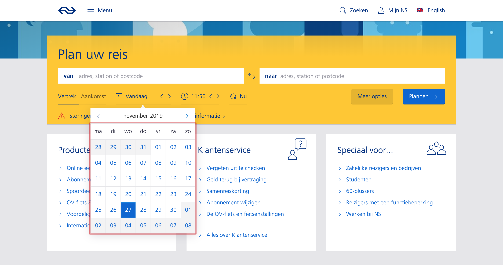

# Web Design

## Exercises

### Excersice 1 - Monday

During this excersise we had to focus on the following points in our newly designed accessible tools:

* Study Situation
* Ignore Conventions
* Prioritise Identity
* Add Nonsense

These all fall under the *Exclusive Design Principles*.

I received the excersise of Marijn, who uses his keyboard for everything on the web.

I choose to take a shot at the **date picker**.

When researching accessible date pickers, I found that it is a pretty known theme in the community.
Despite being pretty known in the community, several large Dutch websites have varying implementations of the date picker:

* [NS](https://www.ns.nl) for example has a very decent and accessible date picker for choosing a departure date.
    In this date picker you can navigate the dates with the arrow keys, also enabling the user to navigate multiple months by just pressing the down key.
    The only negative things I can find about this implementation is that you can not target the 'switch months' buttons at the top of the date picker with the tab keys.
    

* [9292](https://www.9292.nl). This date picker is very similar to the date picker from the NS, with the subtle difference that you don't see in the pop-up window when you navigate beyond the current month.
    You can also not navigate to any other day in the week when navigating beyond the scope of the pop-up window.
    I consider this implementation to be very bad, since it just doesn't do everything that I would want in this functionality.
    

## License

This repository is licensed as [MIT](LICENSE) by [Maikel van Veen](https://github.com/maikxx).